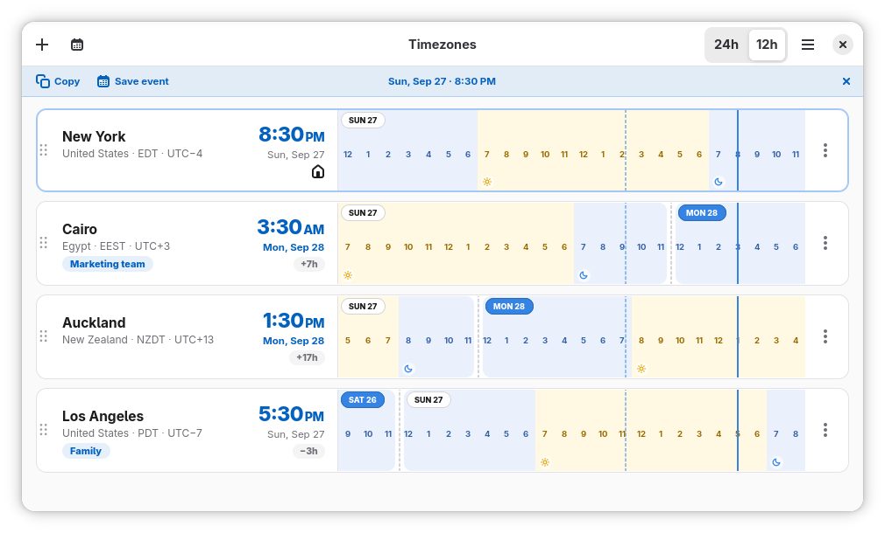
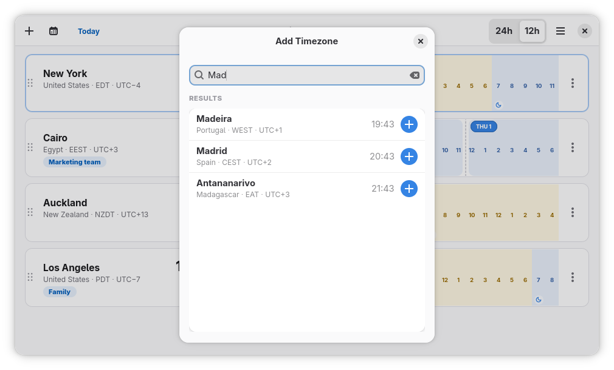
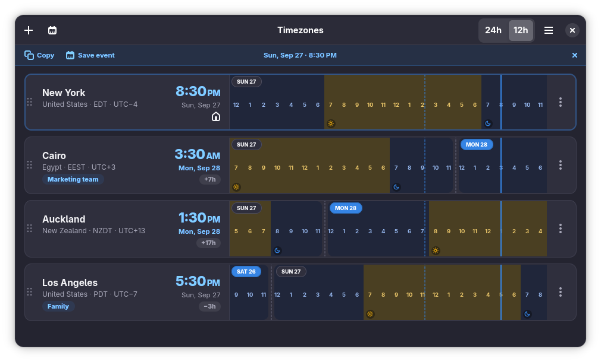
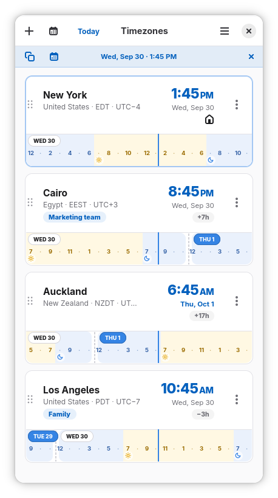
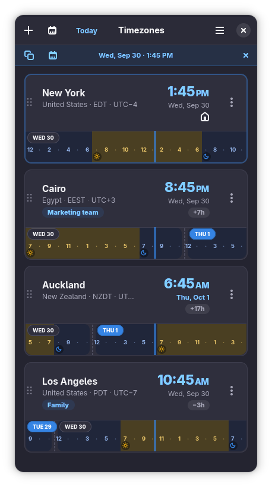

<div align="center">
  
  <h1>Timezones</h1>
</div>

Timezones is a native GTK4 / Libadwaita app that shows a grid of cities and timezones on one shared timeline, so a glance tells you who
is asleep, who is at work, and what an hour of your day looks like everywhere at
once. Park the cursor on a given time and every row reads that same instant to plan your next meeting.

<p align="center">
  
</p>

## Features

### The timeline

- **One shared grid.** Easily compare at glance what a given time represent on different timezones.
- **Scrub to compare.** Move the pointer across the list and every row previews
  its local time for the instant under the cursor, marked in accent color so a
  preview is never mistaken for the real current time.
- **Park an hour.** Click (or press Enter) to pin the instant. A bar names the
  reading and stays until you discard it; the rows keep showing that moment
  while you compare them.
- **Daylight shading.** Cells are colored by whether the sun is actually above
  the horizon over that city — computed from the zone's own coordinates, so it
  holds inside the polar circles too — with sunrise and sunset markers on the
  strip.
- **Date flags.** A timezone whose day rolls over inside the visible window carries a
  date pill naming the day that begins there, so a "tomorrow" is never silent.
- **Daylight-saving warnings.** A row spending the day on both sides of a
  transition says so in words ("Clocks in Cairo move back 1 hour…") and shows
  both abbreviations, e.g. `EDT → EST`.
- **Offset pills.** Each non-reference row shows how far ahead of or behind the
  reference it is — not just UTC, which is rarely the number you want.

### Keyboard navigation

The timeline is a single focusable control, the way a slider is: **Tab** to the
list, then drive it with the arrows.

| Key | Action |
| --- | --- |
| <kbd>Tab</kbd> | Focus the timeline list (it takes focus itself before its rows) |
| <kbd>←</kbd> / <kbd>→</kbd> | Scrub 15 minutes at a time, snapped to quarter hours |
| <kbd>Enter</kbd> / <kbd>Space</kbd> | Park the cursor on the hour it is on |
| <kbd>Esc</kbd> | Discard the parked time (from anywhere in the window) |
| <kbd>Ctrl</kbd>+<kbd>N</kbd> | Add a timezone |
| <kbd>Ctrl</kbd>+<kbd>T</kbd> | Back to today |
| <kbd>Ctrl</kbd>+<kbd>,</kbd> | Preferences |
| <kbd>Ctrl</kbd>+<kbd>Q</kbd> | Quit |

Arrows work from wherever the cursor already is — the keyboard's own position,
a parked selection, the pointer, or simply *now* — and nudging a parked time
adjusts it in place rather than unpinning it first.

### Planning ahead

- **Jump to any date** from the calendar button, and the whole list moves with
  it, daylight-saving changes included. A "Today" button appears only while you
  are parked somewhere else.
- **Copy all times** for the parked instant to the clipboard as an aligned
  block, one line per city, with a date in brackets on any row that is on a
  different day.
- **Save a calendar event.** A parked instant becomes a 30-minute `.ics` invite,
  timed in UTC, with the whole per-city comparison in its description, handed to
  whatever application handles calendar files (through the portal under Flatpak).

<p align="center">
  
</p>

### Your list

- **Search ~400 zones** by city, country, abbreviation or zone id, each result
  showing its current time and offset.
- **Label a row** — "You", "Family", "Team" — and it keeps the city name beside
  the label everywhere it is shared.
- **Pick the reference row**, the one the timeline's hours and every offset are
  measured from.
- **Reorder** by dragging a row onto another, by the row menu's *Move up* /
  *Move down*, or from the reorder dialog in Preferences.
- The list persists to `~/.config/timezones/cities.json`, including an empty one.

### Appearance

- Light, dark, or follow the system.
- 12 or 24-hour clocks, from the header toggle or Preferences.
- Offset pills and daylight shading can each be turned off.
- **Adaptive layout.** Below 880px the rows restack for a phone-width window
  instead of being squeezed; past 1180px the surplus becomes margin, so an hour
  reads at the same scale on an ultrawide as on a laptop.

<p align="center">
  
</p>

On a phone-width screen each row stacks its timeline under the city, and the
header drops the 12/24h toggle (it stays in Preferences):

<p align="center">
  
  
</p>

## Installing

### Flatpak

```sh
flatpak-builder --user --install --force-clean build-flatpak packaging/flatpak/io.github.hernantz.timezones.json
flatpak run io.github.hernantz.timezones
```

Needs the `org.gnome.Platform` and `org.gnome.Sdk` runtimes, version 51.

### From source

```sh
make setup      # meson setup builddir
make install    # meson install -C builddir
```

### RPM

`packaging/rpm/timezones.spec` builds against gtk4, libadwaita ≥ 1.7 and
python3-gobject. `make release VERSION=x.y.z` rewrites the version there and in
`src/VERSION`, which meson and `src/const.py` both read.

## Development

```sh
make run        # builds, compiles the schema, runs from the source tree
```

`make run` sets `TIMEZONES_DEV=1`, which makes the application non-unique so a
source-tree run is not swallowed by an installed copy holding the same
application id.

Runtime requirements: Python 3.9+ (`zoneinfo` is stdlib), PyGObject, GTK 4 and
libadwaita ≥ 1.7. No timezone package is bundled — the IANA database is read
from disk, including `zone.tab` and `iso3166.tab` for each zone's coordinates
and country.

Layout:

| Path | What lives there |
| --- | --- |
| `src/main_window.py` | The window, the scrub state machine, actions |
| `src/timeline.py` | The 24-column strip: cells, cursors, date flags |
| `src/row.py` | One city's row — identity, time block, strip, menu |
| `src/tzinfo_helpers.py` | IANA tables, solar elevation, DST transitions |
| `src/share.py` | Clipboard text and `.ics` export |
| `src/model.py` | Cities and the column arithmetic |
| `data/` | Desktop entry, GSettings schema, icons, CSS, metainfo |
| `po/` | Translations: `timezones.pot` template and one `<lang>.po` per language |

### Localization

The app's own strings are translated with gettext, one `po/<lang>.po` per
language. City and country names are not in there: they come from the
system's `gweather-locations` and `iso-codes` catalogs, so they are already
translated wherever those packages are.

**Updating an existing translation** after strings have changed in the code:

```sh
make pot                # regenerate po/timezones.pot and merge it into every po/<lang>.po
```

Then open `po/<lang>.po` (in a text editor or a tool such as Poedit or GNOME
Translation Editor) and fill in the empty `msgstr ""` entries and any marked
`#, fuzzy` — a fuzzy entry is a guess from a similar old string, and is ignored
until the flag is removed.

**Adding a new language**, say French:

```sh
echo fr >> po/LINGUAS                               # register the language code
make pot                                            # make sure the template is current
msginit -i po/timezones.pot -o po/fr.po -l fr_FR.UTF-8 --no-translator
```

Translate `po/fr.po`, then check it and try it out:

```sh
msgfmt --check --statistics -o /dev/null po/fr.po   # catches broken placeholders
LANGUAGE=fr LC_ALL=fr_FR.UTF-8 make run
```

Set both variables when running: `LANGUAGE` picks the translated text, `LC_ALL`
picks date words, AM/PM and the first day of the week. If the new language does
not show up, `meson setup --reconfigure builddir` makes meson re-read
`po/LINGUAS`.

Things to know while translating:

- Comments starting with `Translators:` above an entry explain what it is for.
- Entries with a `msgctxt` are short strings that mean different things in
  different places (a lone "M" is Monday's initial); translate each for its own
  context.
- Date formats such as `%b %-d` are translatable on purpose: reorder them to
  suit the language (`%-d %b`), and the locale fills in the words.
- Keep every `{placeholder}` and `%` directive from the original.

**Adding a translatable string** in code: wrap it in `_()` (or `C_()`,
`ngettext()`, `N_()` — see `src/i18n.py`), add the file to `po/POTFILES.in` if it
is not listed yet, and run `make pot`.

## License

GPL-3.0-or-later.
